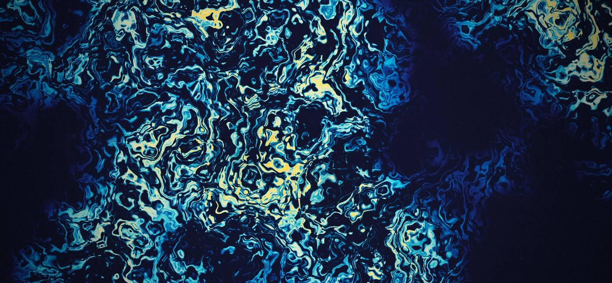
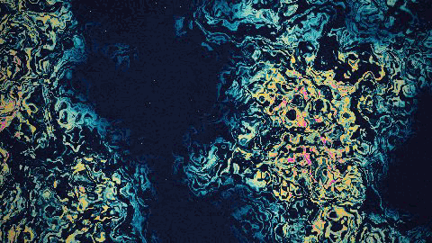
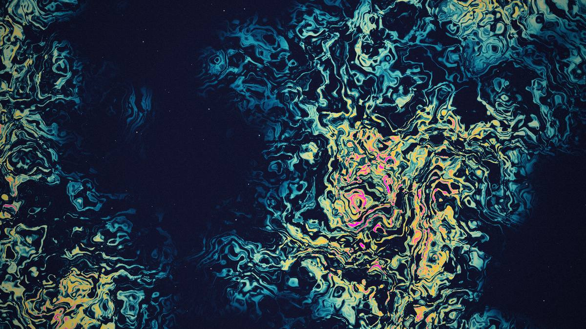
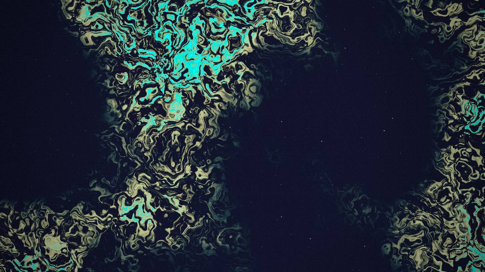
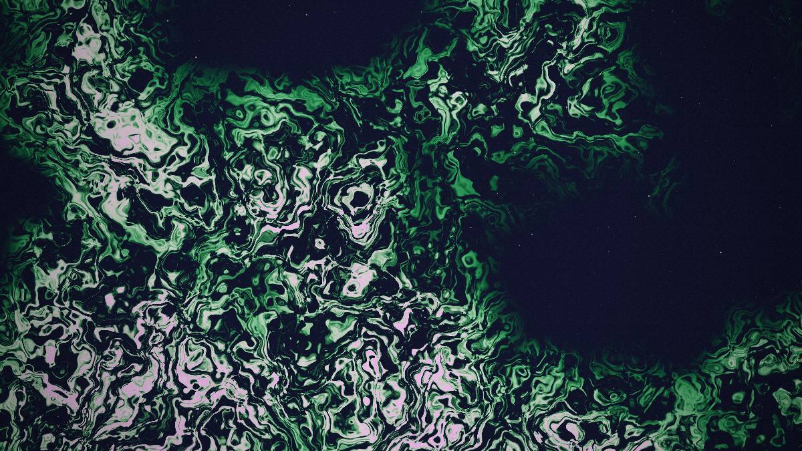
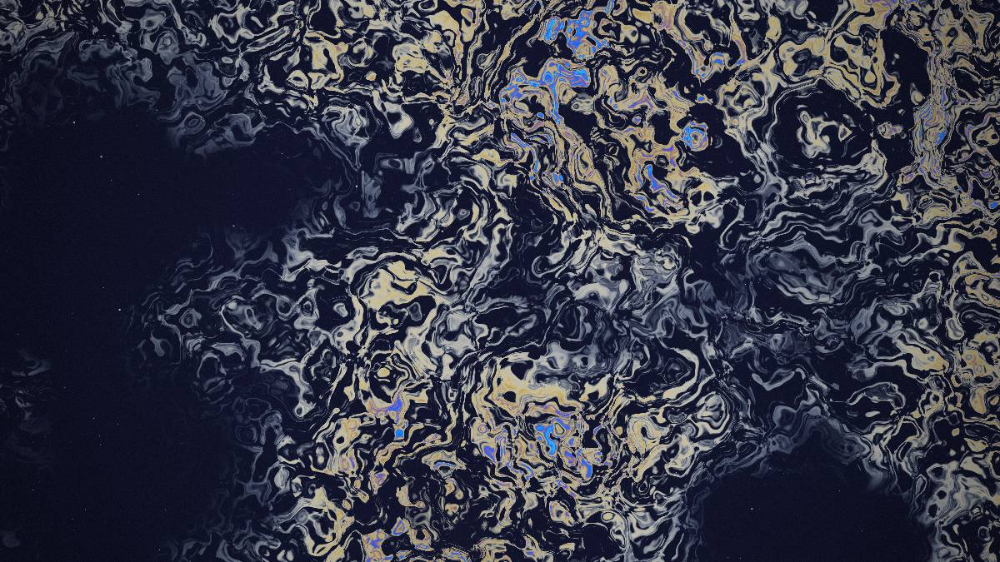
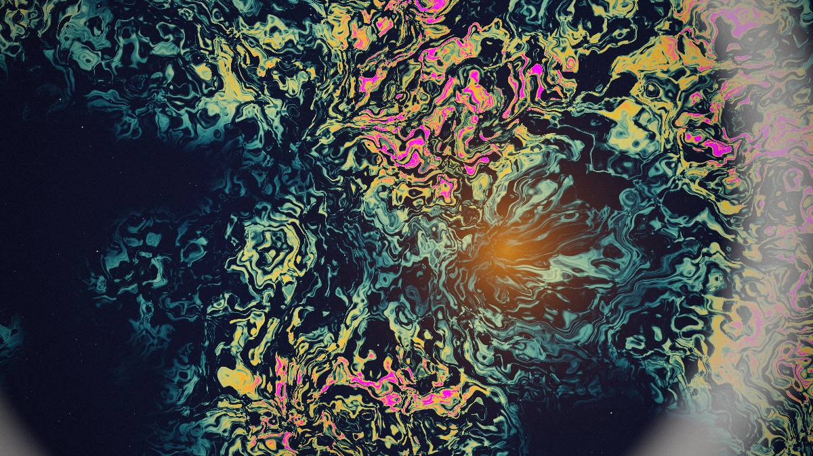

<div align="center">

# NEBULA

### *a living field*

An interactive, GPU-rendered cosmic nebula that flows, glows, and reacts to you — in a **single self-contained HTML file** with zero dependencies and no build step.



<br>
<sub><i>every pixel is computed live in a fragment shader — the field never stops drifting</i></sub>

<!-- LIVE_DEMO -->
### ▶ [**Launch the live demo**](https://nebula-lyart-psi.vercel.app)

</div>

---

## What it is

NEBULA renders a full-screen field of interstellar gas entirely on the GPU. It isn't a video or a texture — every pixel is computed live in a fragment shader from layered, domain-warped noise, so the clouds are always drifting and never repeat. Dense regions ignite into glowing cores, thin regions fall away into deep space where a starfield twinkles through.

Then it responds to you: **drag to stir** the gas, **click to send pulses** of light rippling outward, and **hover** to breathe warmth into the clouds.

## Palettes

Five cosine-gradient palettes, each cross-faded smoothly when you switch:

| aurora | oil |
| :--: | :--: |
|  |  |
| **toxic** | **ice** |
|  |  |

<sub>(plus **ember** — a colder, ashen tone) · every frame above is a real screenshot straight from the shader.</sub>

## Features

- **Pure GPU** — one WebGL2 fragment shader, no particles, no meshes, no libraries
- **Living motion** — domain-warped fractal noise means the field is continuously, organically animated
- **Reactive** — pointer velocity stirs the flow, clicks emit expanding light-rings, proximity adds heat
- **5 palettes** — *aurora · ember · oil · ice · toxic*, cross-faded smoothly when you switch
- **Tunable** — live sliders for Flow, Detail, Chaos, and Glow
- **Save frame** — export the current view as a full-resolution PNG wallpaper
- **Self-contained** — the entire toy is ~22 KB of HTML in a single file; open it straight from disk

## Controls

| Input | Action |
| --- | --- |
| **Move / drag** the pointer | Stir the gas — your speed warps the flow around the cursor |
| **Click** | Emit an expanding pulse of light that ripples through the field |
| **Hover** | A soft, tinted warmth lifts the gas near the cursor |
| **Flow / Detail / Chaos / Glow** sliders | Motion speed · noise octaves · warp strength · luminosity |
| **Palette** swatches | Switch color scheme |
| **Randomize** | Roll a new look |
| **Pause** | Freeze the field |
| **Save frame** | Download the current frame as a PNG |
| **Fullscreen** | Go immersive |

Keyboard: `H` hide/show the panel · `F` fullscreen · `Space` pause · `R` randomize.

<div align="center">



<sub><i>hovering pours warmth into the gas; clicking sends a light-pulse rippling outward</i></sub>

</div>

## How it works

Everything happens in one fragment shader running over a single full-screen triangle:

1. **Noise** — Ashima 2D simplex noise is stacked into fractal Brownian motion (2–7 octaves, driven by *Detail*).
2. **Domain warping** — the field is fed through itself twice — `q = fbm(p)`, `r = fbm(p + q)`, `f = fbm(p + r)` — which is what turns flat noise into swirling, filamentary gas. *Chaos* scales the warp; *Flow* scales time.
3. **Cloud envelope** — a second, low-frequency noise clusters the gas into billows separated by large dark voids, so space actually looks like space.
4. **Emission** — density is gated so most of the frame stays dark; where gas piles up, color ramps from cool wisps to hot cores using an [Inigo Quilez cosine palette](https://iquilezles.org/articles/palettes/), with a soft, wide core bloom.
5. **Stars** — a hashed, twinkling starfield shows through only in the thin, dark regions.
6. **Grade** — a filmic (ACES-style) tone map, gamma, a saturation lift, vignette, and fine grain finish the frame.

Pointer interaction rides on top: velocity displaces the noise domain near the cursor, proximity adds tinted light, and clicks push timed ring-pulses into the shader as uniforms.

No frameworks, no bundler, no `node_modules` — just `index.html`.

## Run it locally

The simplest way is to open the file directly:

```bash
open index.html        # macOS — or just double-click it
```

Or serve it over http (nicer for fullscreen/permissions):

```bash
python3 -m http.server 4488
# then visit http://localhost:4488
```

```bash
npx serve .            # if you prefer Node
```

Requires a browser with **WebGL2** (any modern Chrome, Edge, Firefox, or Safari).

## Deploy

It's a static site, so any static host works. For **Vercel**, zero configuration is needed — it serves `index.html` at the root automatically.

- **Dashboard:** import this repo at [vercel.com/new](https://vercel.com/new) and click **Deploy**.
- **CLI:**
  ```bash
  npm i -g vercel
  vercel --prod
  ```

## Tech

`WebGL2` · `GLSL ES 3.0` · vanilla HTML/CSS/JS · no dependencies · no build.

## Credits

- 2D simplex noise — [Ashima Arts / Stefan Gustavson](https://github.com/ashima/webgl-noise)
- Cosine gradient palettes — [Inigo Quilez](https://iquilezles.org/articles/palettes/)

## License

[MIT](LICENSE) © Matthew Kulka
